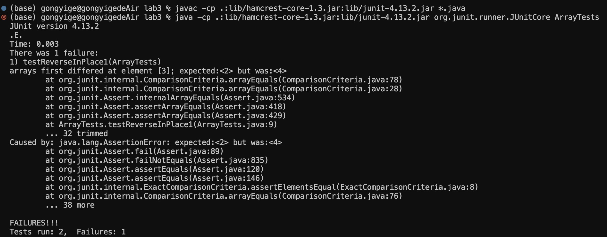

# Part1
We choose the bug in the method `reverseInPlace` in the java file ArrayExamples.

1. A failure-inducing input:
   ```
   @Test 
   public void testReverseInPlace() {
   	int[] input1 = { 1,2,3,4,5 };
   	ArrayExamples.reverseInPlace(input1);
   	assertArrayEquals(new int[]{ 5,4,3,2,1 }, input1);
	}  
   ```
   
  In this case, the failure inducing input is `input1={1,2,3,4,5}`
  
2. An input that doesn't induce a failure:
    ```
   @Test 
    public void testReverseInPlace2() {
    	int[] input1 = { 1 };
    	ArrayExamples.reverseInPlace(input1);
    	assertArrayEquals(new int[]{ 1 }, input1);
	}
   ```
    
  In this case, `input1={1}` does not induce a failure.

3. The symptom:
   

4. The bug:
   
```
static void reverseInPlace(int[] arr) {
    for(int i = 0; i < arr.length; i += 1) {
     	arr[i] = arr[arr.length - i - 1];
    }
  }
```
    
   After it's fixed:
   
   ```
static void reverseInPlace(int[] arr) {
    for(int i = 0; i < arr.length/2; i += 1) {
      int temp = arr[i];
      arr[i] = arr[arr.length - i - 1];
      arr[arr.length - i - 1] = temp;
    }
  }
  ```

5. Briefly describe (2-3 sentences) why the fix addresses the issue.
The bug is this line: `arr[i] = arr[arr.length - i - 1]`, which goes wrong for the iterations after arr.length/2 and copies the original elements back.


To fix this problem, we only iterate for half of the length, saving the element in the first half to `temp`, passing `arr[arr.length - i - 1]` to `arr[i]`, and passing the value of `arr[i]` to `arr[arr.length - i - 1]` through `temp`. By swaping values in pairs, we successfully reverse the array.

# Part2 for `grep` command

> The following four commands are all searched from the same source: https://www.geeksforgeeks.org/grep-command-in-unixlinux/


1. **`grep -c` examples:**
   
	```
	(base) gongyige@gongyigedeMacBook-Air technical % grep -c "gene" biomed/*.txt
	biomed/1468-6708-3-1.txt:0
	biomed/1468-6708-3-10.txt:1
	biomed/1468-6708-3-3.txt:1
	biomed/1468-6708-3-4.txt:6
	biomed/1468-6708-3-7.txt:3
	biomed/1471-2091-2-10.txt:2
	biomed/1471-2091-2-11.txt:12
	biomed/1471-2091-2-12.txt:4
	biomed/1471-2091-2-13.txt:32
	biomed/1471-2091-2-16.txt:3
	...
	biomed/rr166.txt:10
	biomed/rr167.txt:11
	biomed/rr171.txt:5
	biomed/rr172.txt:10
	biomed/rr191.txt:32
	biomed/rr196.txt:12
	biomed/rr37.txt:12
	biomed/rr73.txt:4
	biomed/rr74.txt:2
	```
 
 **Explanation**: `grep -c` option counts the number of appearance of the pattern in the file given. In this example, it gives how many times `gene` occur in each file within the biomed directory, which is useful because we can find out how many times the pattern occur in each file without manually counting.
 
	```
	(base) gongyige@gongyigedeMacBook-Air technical % grep -c "gene" biomed/1471-2091-2-13.txt
	32
	```
 **Explanation**: In this example, it gives how many times `gene` occur in the file `biomed/1471-2091-2-13.txt`. This is useful because we can find out how many times the pattern occur in the file without manually counting.

2. **`grep -h` examples:**

```
(base) gongyige@gongyigedeMacBook-Air technical % grep -h "doctors" plos/*.txt
        multibillion-dollar industry of marketing medicines to doctors and (increasingly) directly
        biotechnology and pharmaceutical companies that develop drugs and medical devices; doctors,
        journals reflected the needs of a closed group of doctors. But medicine, its place in the
        expect that many of our readers will be doctors, we hope readers will range from patients
        doctors entered the real world they essentially did as they pleased. Consequently, there
        There was also little to guarantee that once doctors had hung out their shingle, they
        for each individual patient— many well-meaning doctors ultimately were not delivering their
        because it slows doctors down; contemplation is bad for productivity.
        problem, and have initiated programs aimed at sparking curiosity in young doctors (our own
        doctors, or parents, would this now be morally acceptable? I think sometimes it would be.
        Does confidentiality extend beyond the grave? Should doctors publish articles in medical
        the watchful eyes of doctors and other health-care workers, who have reported individual
        doctors take care of each patient as an individual. Carotid ultrasonography is by far the
        Before insulin was discovered and purified, doctors could only watch as their patients
        training tomorrow's doctors. However, follow-up studies of those who graduate suggest that
        medical schools may not be producing doctors who are happy with the profession, or who fit
        came out of recent surveys. One is the difficulty in recruiting doctors who want to become
        general practitioners, the primary care doctors who form the backbone of the UK health
        disturbing is the substantial proportion of doctors in the same surveys who indicated that
        cohort of 77 doctors who graduated from the University of Makere, Uganda, in 1983, 22 had
        presumed to be AIDS. But all of the surviving doctors were in some form of medical
        and patients cared for by doctors who are not cardiologists.
        weight, blood pressure, and such are all targets for treatment, but how do doctors know
            Marketing departments can influence doctors’ prescribing habits
            the roundtable that doctors would come up to her with patients' charts asking her for
            The various techniques drug representatives were trained in to “educate doctors”
            companies was to buy doctors' prescribing records so drug representatives knew “to the
            dime” what drugs doctors were prescribing and could tailor their marketing to them.
            Drug representatives developed “personality profiles” on doctors and were taught to
        advertising outlets and messages that might more effectively catch doctors' attentions.
          representative sample of health-care professionals, we proportionally sampled doctors,
          we systematically sampled from all doctors, nurses, and midwives to acquire information
          practices and attitudes among the three health specialties surveyed (doctors, nurses, and
            people with HIV/AIDS should not be employed in the health field than doctors and that
```
 **Explanation**: `grep -h` option outputs all matched lines for the pattern in the given file. In this case, it gives all the lines that contain "doctors" in all of the txt files within the plos directory, which is useful because we don't have to search for the context where "doctors" appear manually.
 
```
(base) gongyige@gongyigedeMacBook-Air technical % grep -h "gene" plos/pmed.0010024.txt
        generally considered to be a cornerstone of treatment—but how much fluid should be given?
```
 **Explanation**: In this example, it gives all the lines that contain "gene" in the the file `plos/pmed.0010024.txt`, which is useful because we don't have to search for the context where "doctors" appear manually.

3. `grep -l` examples:

```
(base) gongyige@gongyigedeMacBook-Air technical % grep -l "generally" plos/*.txt
plos/journal.pbio.0020052.txt
plos/journal.pbio.0020068.txt
plos/journal.pbio.0020071.txt
plos/journal.pbio.0020146.txt
plos/journal.pbio.0020190.txt
plos/journal.pbio.0020228.txt
plos/journal.pbio.0020241.txt
plos/journal.pbio.0020302.txt
plos/journal.pbio.0020347.txt
plos/journal.pbio.0020401.txt
plos/journal.pbio.0020404.txt
plos/journal.pbio.0020406.txt
plos/journal.pbio.0020440.txt
plos/journal.pbio.0030050.txt
plos/journal.pbio.0030062.txt
plos/journal.pbio.0030102.txt
plos/journal.pbio.0030136.txt
plos/pmed.0010013.txt
plos/pmed.0010021.txt
plos/pmed.0010024.txt
plos/pmed.0010028.txt
plos/pmed.0010042.txt
plos/pmed.0010056.txt
plos/pmed.0020016.txt
plos/pmed.0020034.txt
plos/pmed.0020082.txt
plos/pmed.0020123.txt
plos/pmed.0020232.txt
plos/pmed.0020249.txt
```
 **Explanation**: `grep -l` option outputs the list of files that contain the pattern "generally". In this case, it gives the list of files that contain "generally" in all of the txt files within the plos directory, which is useful because we don't have to manually search for which files contain the targeted pattern among many files.
```
(base) gongyige@gongyigedeMacBook-Air technical % grep -l "bacillus" biomed/*.txt 
biomed/1471-2091-2-12.txt
biomed/1471-2105-3-37.txt
biomed/1471-2148-3-18.txt
biomed/1471-2164-2-9.txt
biomed/1471-2164-3-33.txt
biomed/gb-2001-2-4-research0010.txt
biomed/gb-2002-3-3-research0012.txt
```
 **Explanation**: In this case, it gives the list of files that contain "bacillus" in all of the txt files within the biomed directory, which is useful because we don't have to manually search for which files contain the targeted keyword among many files.
 
4. `grep -w` examples:

```
(base) gongyige@gongyigedeMacBook-Air technical % grep -w "genetical" biomed/*.txt
biomed/1471-2156-4-10.txt:        can be dissected with more precise genetical techniques.
```
 **Explanation**: `grep -w` option outputs all the lines within the given file that contain words that exactly match the pattern. In this case, it gives the line that contain exactly the word `genetical` instead of words like `genetically`, which is useful as it narrows the focus by matching word instead of matching strings to exclude unwanted search results.

```
(base) gongyige@gongyigedeMacBook-Air technical % grep -w "avoparcin" plos/*.txt
plos/pmed.0020232.txt:        use in animals (avoparcin) and humans (vancomycin) [16,17,35–37]. Many European countries
plos/pmed.0020232.txt:        approved avoparcin for animal growth promotion in the 1970s, but the US did not.
plos/pmed.0020232.txt:        avoparcin use in agriculture was apparently much larger than the US community reservoir
plos/pmed.0020232.txt:        The prevalence of VRE in the community declined after the EU banned avoparcin [15].
plos/pmed.0020232.txt:        Thus, avoparcin is at least partly responsible for the reservoir of VRE in the European
plos/pmed.0020232.txt:        community, but how much of that reservoir came from avoparcin and how much came from
plos/pmed.0020232.txt:        attributed to avoparcin. This analysis probably underestimates the real impact because
plos/pmed.0020232.txt:        vancomycin was used less in European than in US hospitals. Thus, avoparcin use in Europe
plos/pmed.0020232.txt:        than US hospitals. Put another way, the impact of avoparcin use on European hospitals was
plos/pmed.0020232.txt:        Despite the evidence that avoparcin use has had a large impact on the emergence and
```
 **Explanation**: In this case, it gives the line that contain exactly the word "avoparcin", which is useful as it narrows the focus by matching word instead of matching strings to exclude unwanted or even irrelavant search results; for example, it excludes irrelavent results like "generally" when you are searching for "gene".
